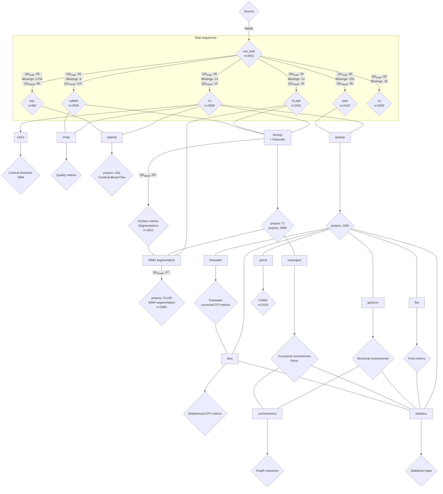

```mermaid

graph TD;
A{Dicoms} -->|bidsify| B{raw_bids <br> n=2652}
subgraph Raw sequences
    B --> | QA<sub>nrad</sub> -26 <br> Missings -14  <br> QA<sub>visual</sub> -14   | C{T1 <br> n=2598}
    B --> | QA<sub>nrad</sub> -26 <br> Missings -12 <br>  QA<sub>visual</sub> -23   | D{FLAIR <br> n=2591}
    B --> | QA<sub>nrad</sub> -26 <br> Missings -159 <br> QA<sub>visual</sub> -48   | E{DWI <br> n=2419}
    B --> | QA<sub>nrad</sub> -26 <br> Missings -6 <br> QA<sub>visual</sub> -114 .   | F{rsfMRI <br> n=2506}
    B --> | QA<sub>nrad</sub> -26 <br> Missings -1734 <br> QA<sub>visual</sub> -62   | G{ASL <br> n=830}
    B --> | QA<sub>nrad</sub> -26 <br> Missings -32  | H{T2 <br> n=2594}
end

C --> a(cat12) --> N{Cortical thickness <br> VBM}
C --- b[ mriqc ] --> O{Quality metrics} 
C --- c[ fmrirep <br> + freesurfer ] ---> P{preproc T1 <br> preproc. fMRI}
C --- e[aslprep] --> R{preproc. ASL <br> Cerebral Blood Flow}

C --- i[qsiprep]
D --- c
F --- b
F --- c
c --> |"QA<sub>visual</sub> -53 ."| Q{Surface metrics <br> Segmentations <br> n=2522}

P --- f[ xcpengine ] ---> S{Functional connectomes <br> ReHo}

G --- e

D --- h[WMH segmentation] --> |"QA<sub>visual</sub> -27 ." | T{preproc. FLAIR <br> WMH segmentation <br> n=2483}
P --- h
Q --- h

E --- i --> U{preproc. DWI}

U --- j[qsirecon] --> V{Structural connectomes}
U --- k[freewater] --> W{Freewater <br> corrected DTI metrics}
U --- l[psmd] --> X{PSMD <br> n=2414}
U --- m[tbss] --> Y{Skeletonized DTI metrics} 
U --- n[fba] --> Z{Fixel metrics}
W --- m

V --- o[connectomics] ---> A1{Graph measures}
S --- o

U --- p[statistics] ---> B1{Statistical maps}
Z --- p
V --- p
S --- p
m --- p
```
